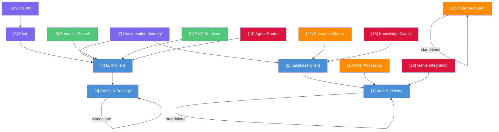

# Architecture

How the 15 modules compose together, what depends on what, and how to build apps from them.

## Dependency Graph



## Dependency Table

| Feature | Requires | Env Vars | Databricks Resources |
|---------|----------|----------|---------------------|
| [1] Auth | — | `DATABRICKS_HOST` | — |
| [2] Lakebase | [1] | `PGHOST`, `PGPORT`, `PGDATABASE`, `DATABRICKS_CLIENT_ID` | Lakebase database |
| [3] Config | — | `.env` file or platform auto-injection | — |
| [4] LLM | [3] | `DATABRICKS_HOST` or `ANTHROPIC_API_KEY` | Foundation Model API |
| [5] Chat | [4] | `SERVING_ENDPOINT` | Foundation Model API |
| [6] Voice | [5] | `TTS_ENDPOINT`, `ASR_ENDPOINT` | TTS + ASR model serving endpoints |
| [7] Memory | [2], [4] | Lakebase vars | Lakebase database, Foundation Model API |
| [8] Search | [4] | `VECTOR_SEARCH_ENDPOINT`, `VECTOR_SEARCH_INDEX` | Vector Search endpoint + index, FMAPI |
| [9] RAG | [4] | `VECTOR_SEARCH_ENDPOINT`, `VECTOR_SEARCH_INDEX` | Vector Search endpoint + index, FMAPI |
| [10] Files | [1] | `CATALOG`, `FILE_VOLUME_PATH` | UC Volume |
| [11] Charts | — | — | — |
| [12] Library | [2] | Lakebase vars | Lakebase database |
| [13] Genie | [1] | `GENIE_SPACE_*` | Genie Space(s) |
| [14] Router | [4] | `SERVING_ENDPOINT` | Foundation Model API |
| [15] Knowledge | [2] | Lakebase vars | Lakebase database |

## Repo Structure

```
databricks-app-modular-features/
│
├── foundation/                      # Shared infrastructure
│   ├── auth/                        # [1] Auth & Identity
│   │   ├── README.md
│   │   ├── identity.py              # Identity model, TokenSource protocol
│   │   ├── obo.py                   # OBO + PAT + SP fallback chain
│   │   └── client_builder.py        # AsyncOpenAI client factory
│   │
│   ├── lakebase/                    # [2] Lakebase Client
│   │   ├── README.md
│   │   ├── client.py                # Async + sync connections, pooling
│   │   ├── schema.py                # DDL auto-init helpers
│   │   └── credentials.py           # OAuth token injection + refresh
│   │
│   ├── config/                      # [3] Config & Settings
│   │   ├── README.md
│   │   └── settings.py              # Pydantic BaseSettings template
│   │
│   └── llm/                         # [4] LLM Client
│       ├── README.md
│       ├── client.py                # FMAPI + Anthropic unified interface
│       └── streaming.py             # SSE streaming helpers
│
├── features/                        # Drop-in features
│   ├── chat/                        # [5] Chat
│   │   ├── README.md
│   │   ├── backend/
│   │   │   ├── router.py            # FastAPI SSE endpoint
│   │   │   ├── events.py            # Event type definitions
│   │   │   └── followups.py         # Suggestion generation
│   │   └── frontend/
│   │       ├── useChat.ts           # SSE consumption hook
│   │       ├── ChatMessage.tsx       # Message rendering (markdown, code, charts)
│   │       ├── ChatInput.tsx         # Text input + file upload + mic
│   │       ├── ThinkingSection.tsx   # Agent reasoning visibility
│   │       ├── CitationPreview.tsx   # [1][2] citation rendering
│   │       └── MarkdownRenderer.tsx  # Safe markdown → React
│   │
│   ├── voice-io/                    # [6] Voice I/O
│   │   ├── README.md
│   │   ├── backend/
│   │   │   ├── tts.py               # TTS endpoint (parallel inference + WAV concat)
│   │   │   ├── asr.py               # ASR endpoint wrapper
│   │   │   └── speech_normalizer.py  # Text → speech-ready text
│   │   └── frontend/
│   │       ├── useVoiceConversation.ts  # State machine hook
│   │       ├── VoiceOverlay.tsx     # Mic UI + VAD visualization
│   │       └── audioUtils.ts        # Vanilla TS: WAV, PCM, volume
│   │
│   ├── conversation-memory/         # [7] Conversation Memory
│   │   ├── README.md
│   │   ├── memory.py                # Load/save/summarize
│   │   └── schema.sql               # conversations + messages DDL
│   │
│   ├── semantic-search/             # [8] Semantic Search
│   │   ├── README.md
│   │   ├── search.py                # Query rewriting + VS query + re-ranking
│   │   ├── filters.py               # NL filter extraction
│   │   └── intents.py               # Intent detection + bonus scoring
│   │
│   ├── rag-retriever/               # [9] RAG Retriever
│   │   ├── README.md
│   │   ├── retriever.py             # Multi-query decomposition + retrieval
│   │   ├── reranker.py              # Instruction-aware scoring
│   │   └── citations.py             # Citation extraction + formatting
│   │
│   ├── file-processing/             # [10] File Processing
│   │   ├── README.md
│   │   ├── processor.py             # Multi-format parser
│   │   ├── storage.py               # UC Volume management
│   │   └── router.py                # Upload/download endpoints
│   │
│   ├── chart-generation/            # [11] Chart Auto-generation
│   │   ├── README.md
│   │   ├── compileVegaLiteSpec.ts   # Column types → Vega-Lite spec
│   │   ├── tableToChart.ts          # SQL results → chart data
│   │   └── VegaLiteChart.tsx        # React chart component
│   │
│   ├── research-library/            # [12] Research Library
│   │   ├── README.md
│   │   ├── service.py               # Collections, annotations, history, prefs
│   │   ├── router.py                # FastAPI endpoints
│   │   └── schema.sql               # DDL for all library tables
│   │
│   ├── genie-integration/           # [13] Genie Integration
│   │   ├── README.md
│   │   ├── genie_client.py          # Space detection + conversation polling
│   │   └── formatter.py             # Result → chart/table format
│   │
│   ├── agent-router/                # [14] Agent Router
│   │   ├── README.md
│   │   ├── graph.py                 # LangGraph agent graph
│   │   ├── supervisor.py            # Intent classification + routing
│   │   └── state.py                 # Shared state definition
│   │
│   └── knowledge-graph/             # [15] Knowledge Graph
│       ├── README.md
│       ├── service.py               # Entity/relationship CRUD
│       └── schema.sql               # DDL for entities + relationships
│
├── examples/                        # Runnable example apps
│   ├── minimal-chat/                # Features: [1] + [3] + [4] + [5]
│   │   ├── app.py
│   │   ├── app.yaml
│   │   └── frontend/
│   │
│   ├── voice-chatbot/               # Features: [1] + [3] + [4] + [5] + [6] + [7]
│   │   ├── app.py
│   │   ├── app.yaml
│   │   └── frontend/
│   │
│   └── search-and-ask/              # Features: [1] + [2] + [3] + [4] + [8] + [9] + [12]
│       ├── app.py
│       ├── app.yaml
│       └── frontend/
│
└── docs/
    └── DEPENDENCY_MAP.md
```

## Composition Patterns

### Pattern 1: Minimal Chat App

The simplest useful app — text chat with follow-up suggestions.

```
[3] Config → [4] LLM Client → [5] Chat
                                  ↓
                           FastAPI + React
```

**Databricks resources**: Foundation Model API (pay-per-token)

**app.yaml resources**: None required (FMAPI is serverless)

---

### Pattern 2: Voice-Enabled Chatbot

Full voice conversation with persistent memory across sessions.

```
[1] Auth → [2] Lakebase → [7] Memory
              ↓
[3] Config → [4] LLM → [5] Chat → [6] Voice I/O
```

**Databricks resources**: Foundation Model API, TTS endpoint, ASR endpoint, Lakebase database

**app.yaml resources**:
```yaml
resources:
  - name: lakebase-db
    type: database
    database:
      instance: my-lakebase-instance
      permission: CAN_CONNECT_AND_CREATE
```

---

### Pattern 3: Search & Ask with Research Library

Semantic search over a document corpus, with RAG for Q&A, and user collections for organizing findings.

```
[1] Auth → [2] Lakebase → [12] Research Library
              ↓
[3] Config → [4] LLM → [8] Semantic Search
                    ↓
                  [9] RAG Retriever
```

**Databricks resources**: Foundation Model API, Vector Search endpoint + index, Lakebase database

---

### Pattern 4: Full Analytics Platform

Everything — multi-agent routing across Genie, RAG, search, with voice I/O and persistent knowledge.

```
[1] Auth → [2] Lakebase → [7] Memory
              ↓              ↓
           [12] Library   [15] Knowledge Graph
              ↓
[3] Config → [4] LLM → [14] Agent Router
                            ↓
              ┌─────────────┼──────────────┐
           [13] Genie    [9] RAG     [8] Search
              ↓
           [5] Chat → [6] Voice I/O
              ↓
           [11] Charts
              ↓
           [10] Files
```

**Databricks resources**: Everything (FMAPI, Vector Search, Lakebase, Genie Space(s), TTS/ASR endpoints, UC Volume)

## Integration Guide

### Adding a feature to an existing FastAPI app

1. **Copy the feature directory** into your project
2. **Install dependencies** from the feature's README
3. **Set env vars** in your `app.yaml` or `.env`
4. **Mount the router**:

```python
from features.chat.backend.router import chat_router
app.include_router(chat_router, prefix="/api/chat")
```

5. **Import frontend components** into your React app:

```typescript
import { useChat } from './features/chat/frontend/useChat';
import { ChatMessage } from './features/chat/frontend/ChatMessage';
```

### Local development

All features work locally with minimal config:
- Set `DATABRICKS_HOST` and `DATABRICKS_TOKEN` in `.env`
- Foundation Model API works immediately (pay-per-token, no endpoint to create)
- Lakebase features need a Lakebase database (or swap in local PostgreSQL)
- Voice features need TTS/ASR model serving endpoints deployed on your workspace
